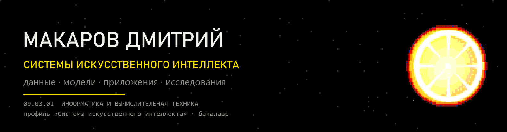

  

  
  
  

### О себе

Системы искусственного интеллекта: работаю с данными, обучаю и оцениваю модели,
разрабатываю и тестирую приложения, участвую в научно-исследовательских и
опытно-конструкторских разработках.

Направление **09.03.01 «Информатика и вычислительная техника»**, профиль
**«Системы искусственного интеллекта»** — НГИЭУ, программа МГТУ им. Н.Э. Баумана.

### Проекты

| Проект | О чём | Стек |
| --- | --- | --- |
| **[Обнаружение транспорта на РЛИ-снимках](https://github.com/x1emonadex/sived-sar-vehicle-detection)** | Датасет SIVED: 1044 снимка, 12 013 объектов. Разметка переведена из DOTA в YOLO, обучение YOLO12n, mAP50 0.982 на тестовой выборке. Приложение показывает результат модели рядом с классической обработкой | Python · PyTorch · Ultralytics · OpenCV · Streamlit |
| **[Календарь дней рождения](https://github.com/x1emonadex/BirthdayCalendar)** | Android и Windows из одной кодовой базы: локальная база, напоминания, экспорт в Excel и CSV, перенос списка между устройствами. 290 автотестов | Dart · Flutter · Riverpod · Drift · SQLite |
| **[Свободные аудитории](https://github.com/x1emonadex/NGIEUAudience)** | Занятость кабинетов по расписанию: фильтры по дню, паре, неделе и диапазону номеров, поиск по преподавателю и группе, счётчики свободных кабинетов | Kotlin · Compose Multiplatform · Ktor |
| **[Анализатор кластеризации K-means](https://github.com/x1emonadex/K-means)** | Алгоритм k-means с нуля: инициализация k-means++, метрики качества, загрузка CSV с автоопределением формата, интерфейс на Win32 API | C++17 · Win32 API |

### Стек

  
  
  
  
  
  
   
  
  
  
  
  
   
  
  
  
  

### Ссылки

- Портфолио и резюме — **[x1emonadex.github.io](https://x1emonadex.github.io)**
- Резюме в PDF — **[resume.pdf](https://x1emonadex.github.io/resume.pdf)**
- Все репозитории — **[github.com/x1emonadex?tab=repositories](https://github.com/x1emonadex?tab=repositories)**

  Проекты учебные и практические. Все числа взяты из логов обучения и автотестов.

